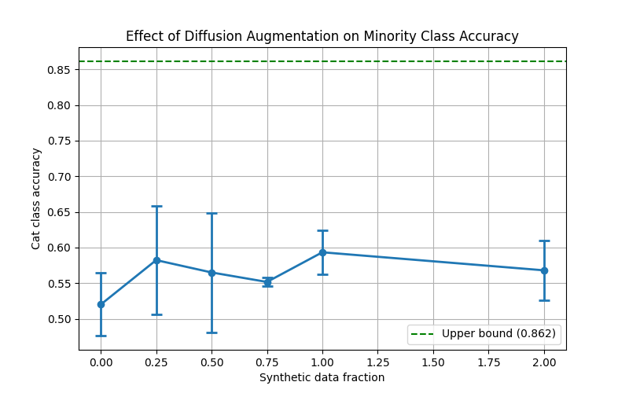

# Diffusion-Based Data Augmentation for Class Imbalance

Investigates whether synthetic images generated by a pretrained class-conditional diffusion model can improve classifier performance on an artificially imbalanced dataset.

## Overview

Class imbalance is a common problem in real-world datasets — models trained on skewed data tend to underperform on minority classes. This project tests whether diffusion-based synthetic oversampling can close that accuracy gap.

**Setup:**
- CIFAR-10 training set artificially imbalanced by retaining only 10% of cat (class 3) images (~500 vs 5000 per other class)
- Synthetic cat images generated using a pretrained class-conditional DDPM ([Ketansomewhere/cifar10_conditional_diffusion1](https://huggingface.co/Ketansomewhere/cifar10_conditional_diffusion1))
- ResNet18 (pretrained on ImageNet, fine-tuned on CIFAR-10) evaluated on cat-class accuracy across 6 synthetic data fractions
- Each condition averaged over 3 independent runs to estimate variance

## Results

| Condition | Cat Accuracy |
|---|---|
| Upper bound (full balanced data) | 0.862 |
| Baseline (10% real cats, no synthetic) | 0.52 |
| + 0.25x synthetic fraction | 0.58 |
| + 0.50x synthetic fraction | 0.56 |
| + 0.75x synthetic fraction | 0.55 |
| + 1.00x synthetic fraction | **0.60** |
| + 2.00x synthetic fraction | 0.57 |

Synthetic augmentation consistently improved minority-class accuracy over the imbalanced baseline, peaking at 1.0x synthetic fraction before diminishing returns set in. The gap to the upper bound (0.86) suggests synthetic image quality limits further improvement.



## Key Findings

- Diffusion augmentation provides a consistent but modest improvement (~+0.08 accuracy) over a heavily imbalanced baseline
- Performance plateaus and slightly degrades at higher synthetic fractions, suggesting an optimal augmentation ratio exists
- The quality ceiling of 32×32 generated images upsampled to 224×224 for ResNet18 input likely limits absolute gains

## Stack

- PyTorch + torchvision
- Hugging Face diffusers
- ResNet18 (pretrained, fine-tuned)
- CIFAR-10

## How to Run

```bash
pip install -r requirements.txt

# Generate synthetic images and run full experiment
python preprocess.py

# Generated images are cached to disk after first run for faster re-runs
```

## Limitations

- Single minority class tested (cat); results may vary across other classes
- Unconditional → conditional pipeline adds filtering overhead; a natively conditional model at higher resolution could improve results
- Fixed learning rate (0.0001) across all conditions; scheduling may improve absolute accuracy
