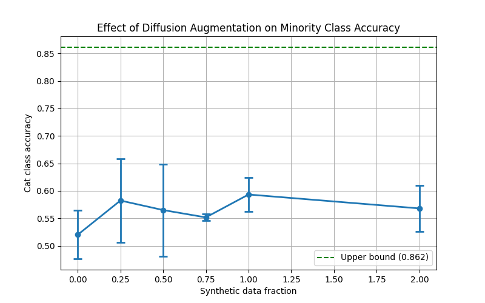

# Diffusion-Based Data Augmentation for Class Imbalance

[](https://github.com/davidbian1/diffusion-augmentation-cifar10/actions/workflows/tests.yml)

Investigates whether synthetic images generated by a pretrained class-conditional diffusion model can improve classifier performance on an artificially imbalanced dataset.

## Overview

Class imbalance is a common problem in real-world datasets — models trained on skewed data tend to underperform on minority classes. This project tests whether diffusion-based synthetic oversampling can close that accuracy gap.

**Setup:**
- CIFAR-10 training set artificially imbalanced by retaining only 10% of cat (class 3) images (~500 vs 5000 per other class)
- Synthetic cat images generated using a pretrained class-conditional DDPM ([Ketansomewhere/cifar10_conditional_diffusion1](https://huggingface.co/Ketansomewhere/cifar10_conditional_diffusion1))
- ResNet18 (pretrained on ImageNet, fine-tuned on CIFAR-10) evaluated on cat-class accuracy across 6 synthetic data fractions
- Each condition averaged over 3 independent runs to estimate variance, with a fixed base seed (42) so each run is individually reproducible while still varying run-to-run

## Results

| Condition | Cat Accuracy |
|---|---|
| Upper bound (full balanced data) | 0.862 |
| Baseline (10% real cats, no synthetic) | 0.52 |
| + 0.25x synthetic fraction | 0.58 |
| + 0.50x synthetic fraction | 0.56 |
| + 0.75x synthetic fraction | 0.55 |
| + 1.00x synthetic fraction | **0.60** |
| + 2.00x synthetic fraction | 0.57 |

Synthetic augmentation consistently improved minority-class accuracy over the imbalanced baseline, peaking at 1.0x synthetic fraction before diminishing returns set in. The gap to the upper bound (0.86) suggests synthetic image quality limits further improvement.



## Key Findings

- Diffusion augmentation provides a consistent but modest improvement (~+0.08 accuracy) over a heavily imbalanced baseline
- Performance plateaus and slightly degrades at higher synthetic fractions, suggesting an optimal augmentation ratio exists
- The quality ceiling of 32×32 generated images upsampled to 224×224 for ResNet18 input likely limits absolute gains

## Stack

- PyTorch + torchvision
- Hugging Face diffusers
- ResNet18 (pretrained, fine-tuned)
- CIFAR-10

## Project Structure

```
.
├── .github/workflows/
│   └── tests.yml               # CI: runs the test suite on push/PR
├── src/
│   ├── generate.py             # class-conditional DDPM sampling pipeline
│   ├── preprocess.py           # config, imbalance construction, training loop, experiment entry point
│   └── check_environment.py    # CUDA/torch environment sanity check
├── tests/
│   ├── test_preprocess.py      # unit tests for the data preprocessing logic
│   ├── test_config.py          # unit tests for CLI argument parsing / defaults
│   └── test_experiment_tracking.py  # unit tests for run artifact persistence
├── Dockerfile
├── generate.slurm              # SLURM job script for cluster runs
├── requirements.txt
└── results.png
```

Each run also produces (gitignored, not part of the repo):
- `generated_images/` — cached synthetic images, reused on subsequent runs
- `results/<timestamp>/` — that run's `config.json`, `metrics.json`, and a copy of the plot
- `checkpoints/` — trained model weights, only when `--save-checkpoints` is passed

## How to Run

```bash
pip install -r requirements.txt

# Generate synthetic images and run full experiment (uses the same defaults as the results below)
python -m src.preprocess

# Generated images are cached to generated_images/ after first run for faster re-runs
```

Docker:

```bash
docker build -t diffusion-augmentation .
docker run --gpus all diffusion-augmentation
```

## Configuration

All experiment settings are CLI flags (see `python -m src.preprocess --help`); defaults match the results reported above.

| Flag | Default | Description |
|---|---|---|
| `--target-class` | `3` | CIFAR-10 class index to imbalance (cat) |
| `--first-fraction` | `0.1` | Fraction of the target class kept in the imbalanced baseline |
| `--target-fractions` | `0.25 0.5 0.75 1.0 2.0` | Synthetic data fractions to evaluate |
| `--num-epochs` | `5` | Training epochs per run |
| `--num-runs` | `3` | Independent runs averaged per condition |
| `--lr` | `0.0001` | Adam learning rate |
| `--seed` | `42` | Base random seed |
| `--save-checkpoints` | off | Save each run's trained model weights |

Example: a quick smoke test with a single fraction and one run per condition:

```bash
python -m src.preprocess --num-runs 1 --num-epochs 1 --target-fractions 1.0
```

## Testing

```bash
pip install pytest
pytest
```

Unit tests cover the data preprocessing primitives (imbalance construction,
synthetic dataset wrapping, seeding), CLI argument parsing, and run artifact
persistence. Training and generation themselves are not covered by tests
since they require a GPU and network access to pull the pretrained
checkpoint; CI runs the full suite on every push and PR.

## Limitations

- Single minority class tested (cat); results may vary across other classes
- Unconditional → conditional pipeline adds filtering overhead; a natively conditional model at higher resolution could improve results
- Fixed learning rate (0.0001) across all conditions; scheduling may improve absolute accuracy

## Contributing

This is a small research/portfolio project, but issues and pull requests are
welcome — e.g. testing additional minority classes, adding a learning rate
schedule, or extending test coverage to the training loop with a mocked model.
Please open an issue to discuss non-trivial changes before submitting a PR.

## License

Released under the [MIT License](LICENSE).
